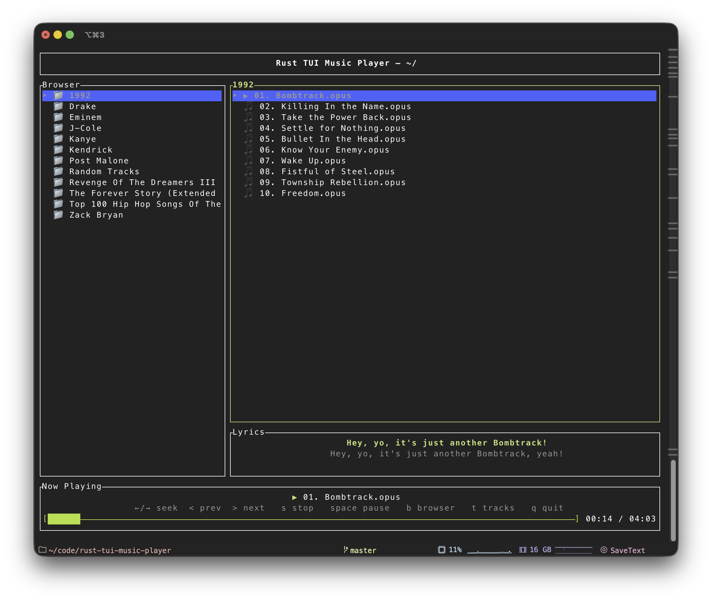
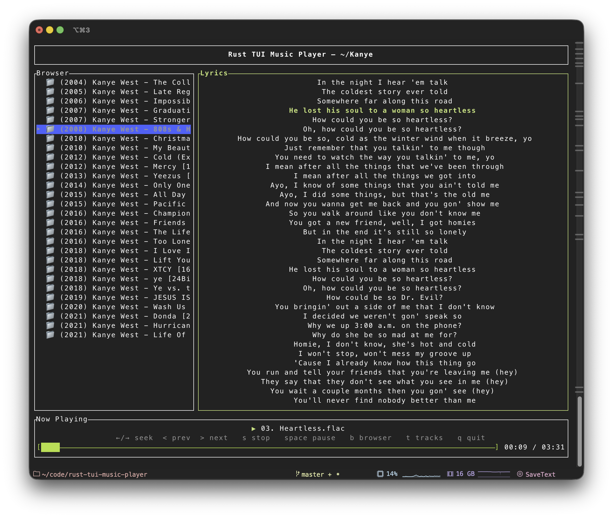

# Rust TUI Music Player

A terminal-based music player built in Rust, designed for fast, keyboard-driven music browsing and playback with a focus on **clean architecture**, **explicit state ownership**, and **predictable behavior**.

This project emphasizes filesystem-based music organization, album-aware playback, and a fully time-synced lyrics system — all within a responsive, flicker-free terminal UI.

---

## Screenshots

### Browser, Album, and Mini Lyrics



### Full Lyrics View



## Features

- **Keyboard-driven navigation**
  Browse your music library using arrow keys and Enter, with explicit pane focus switching

- **Hierarchical album view**
  Navigate directory trees and automatically detect album folders (leaf directories with audio files)

- **Persistent album context**
  Album selection remains active even when browsing other directories

- **Playback controls**
  Play, pause, seek forward/backward, skip to next/previous track, and jump to now-playing

- **Real-time progress display**
  Shows current playback position and total duration

- **Now-playing highlighting**
  Visual indicator of the currently playing track across album and browser views

- **Time-synced lyrics (.lrc)**
  Lyrics are parsed, synced to playback time, and displayed in both mini and full-screen views

- **Background lyrics fetching**
  If no local `.lrc` file exists, synced lyrics may be fetched in the background using the
  [lrclib](https://github.com/tranxuanthang/lrclib) API and cached locally

- **Clean separation of concerns**
  Modular architecture with strict boundaries between UI, state, events, and player control

---

## Architecture Overview

The application follows a strict **event-driven state machine** pattern:

```

Input Events → Event Loop → State Mutations → UI Rendering

```

### Key Design Principles

#### Single Source of Truth

All mutable state lives in `AppState`.
No other module mutates application data.

#### Pure Rendering

The UI module is read-only and produces no side effects.
Focus changes never mutate application data.

#### Decoupled Concerns

- **UI Module (`ui/`)**
  Pure rendering using `ratatui`; reads from `AppState` only

- **Event Module (`event/`)**
  Semantic application events (input-agnostic)

- **Input Module (`input/`)**
  Keyboard input mapped to semantic `AppEvent`s

- **Player Module (`player/`)**
  mpv subprocess management and JSON IPC communication

- **Lyrics Module (`lyrics/`)**
  LRC parsing and time-based lyric state tracking

- **Filesystem Module (`fs/`)**
  Directory traversal, album detection, and entry enumeration

- **App Module (`app/`)**
  Core application state and invariants

---

## Album State Management

The player distinguishes between **two independent navigation contexts**:

### Browser State

Tracks filesystem navigation:

- `current_dir`
- `browser_entries`
- `selected_index`

### Album State

Tracks playback context:

- `active_album_dir`
- `album_entries`
- `album_selected`

An **album** is defined as any directory that:

- Contains one or more audio files
- Contains no subdirectories

Directories with audio files but no subdirectories — including the root directory — are treated as **implicit albums**.

Once an album is activated, it remains active even if the user navigates elsewhere in the browser. This enables the mental model:

> Navigate the filesystem with one hand, control playback with the other.

---

## Player Integration

Playback is handled by [mpv](https://mpv.io), controlled via Unix socket JSON IPC.

The player is launched with:

```

--no-video --idle=yes --input-ipc-server=/tmp/rust-tui-mpv.sock

```

The `Player` abstraction exposes:

- Playback state (Playing / Paused / Stopped)
- Current track path
- Real-time playback metrics (position, duration)
- Automatic track advancement
- Clean shutdown and process lifecycle handling

---

## Lyrics System

### Lyrics Loading

- Timestamped `.lrc` files are detected alongside audio files
- Lyrics are loaded automatically when a track starts playing
- If no local `.lrc` file exists, lyrics may be fetched in the background and cached
- Lyrics are cleared on stop or track change

Expected file layout:

```

Music/
├── Album/
│   ├── Track01.mp3
│   ├── Track01.lrc
│   └── Track02.mp3

```

### LRC Format

```

[00:12.00]First line of lyrics
[00:17.20]Second line of lyrics
[00:21.10]Third line of lyrics

```

### Display Modes

- **Mini lyrics view**
  Displayed beneath the album track list, always time-synced

- **Full lyrics view** (`l`)
  Full-height lyrics pane with:
  - Time-synced highlighting
  - Centered active line
  - Manual scrolling with automatic resume

If no lyrics are available, the lyrics pane displays a clear fallback message.

---

## Installation & Running

### Prerequisites

- **Rust 1.70+** (2021 semantics)
- **mpv** (audio backend)
- **Unix socket support** (Linux, macOS, or WSL2)

### Install mpv

**macOS (Homebrew)**

```bash
brew install mpv
```

**Debian / Ubuntu**

```bash
sudo apt-get install mpv
```

**Arch Linux**

```bash
sudo pacman -S mpv
```

### Build and Run

```bash
git clone https://github.com/yourusername/rust-tui-music-player.git
cd rust-tui-music-player
cargo run
```

For release builds:

```bash
cargo build --release
./target/release/rust-tui-music-player
```

By default, the player starts with the music library rooted at:

```
~/Downloads/Media/Music
```

---

## Contributing

Contributions are welcome. Please follow these guidelines:

- Preserve the existing architecture
- Keep all state mutations in the event loop
- UI code must remain pure
- Explain **why**, not just **what**
- Route new behavior through `AppEvent` → `AppState` → rendering

---

## License

MIT License. See the `LICENSE` file for details.

---

## Acknowledgments

- Built with [ratatui](https://ratatui.rs)
- Terminal input via [crossterm](https://github.com/crossterm-rs/crossterm)
- Audio playback powered by [mpv](https://mpv.io)
- Synced lyrics provided by [lrclib](https://github.com/tranxuanthang/lrclib)

---
